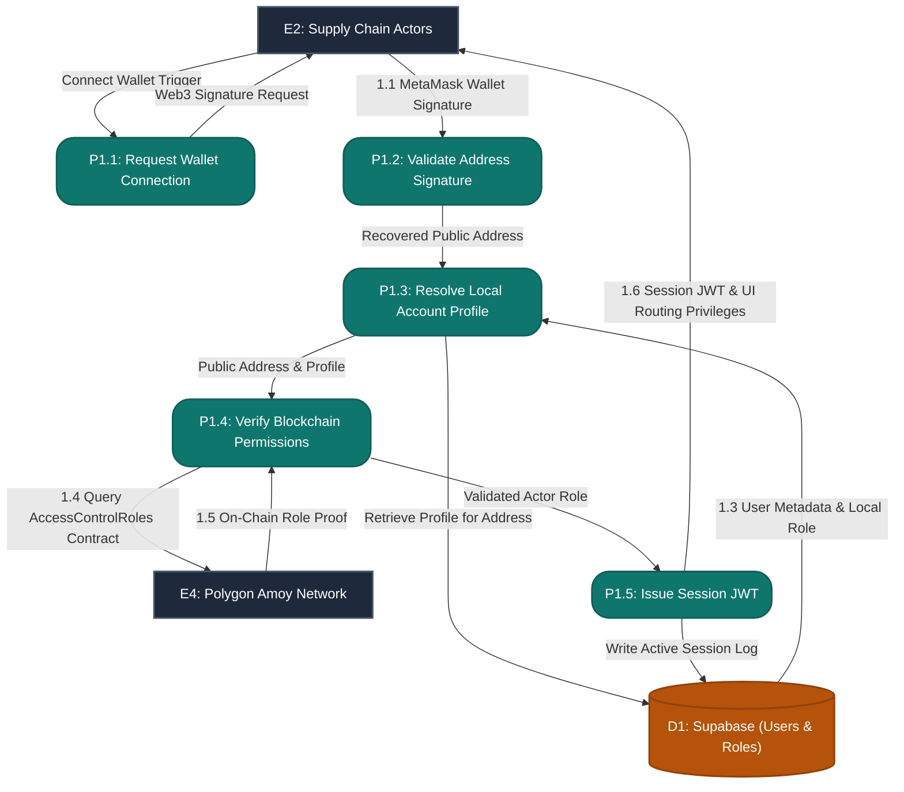

# Data Flow Diagrams (DFDs) for BE Major Project

This document contains publication-quality Data Flow Diagrams (DFDs) for the project **"A Decentralized IoT-Blockchain Framework with Customized Smart Contracts for Transparent and Traceable Agricultural Supply Chains"**. 

It spans from the Context Diagram (Level 0) to Level 1 (System Overview) and expands into five Level 2 diagrams for core sub-systems.

---

## 1. Context Diagram (Level 0)

The Context Diagram defines the boundary of the system, showing the net inputs and outputs between the core system and external entities.

### Diagram
```mermaid
graph TD
    classDef entity fill:#1e293b,stroke:#475569,stroke-width:2px,color:#fff;
    classDef process fill:#0f766e,stroke:#115e59,stroke-width:2px,color:#fff,rx:20px,ry:20px;
    
    %% External Entities
    E1["E1: IoT Sensors<br>(Simulated/ESP32)"]:::entity
    E2["E2: Supply Chain Actors<br>(Farmer, Transporter, Wholesaler, etc.)"]:::entity
    E3["E3: Consumers"]:::entity
    E4["E4: Polygon Amoy Network"]:::entity
    
    %% Process
    P0("P0: Decentralized IoT-Blockchain Traceability System"):::process
    
    %% Data Flows
    E1 -->|Raw Sensor Readings| P0
    E2 -->|Wallet Connection & Registry Data| P0
    P0 -->|Breach Alerts & Role Permissions| E2
    E3 -->|Scan QR Code (Batch ID)| P0
    P0 -->|Provenance & Quality Timeline| E3
    P0 -->|Transaction Calls & Policy Configurations| E4
    E4 -->|Transaction Receipts & Event Logs| P0
```

### Component Analysis

#### External Entities
*   **E1: IoT Sensors**: Physical or simulated devices tracking shipment GPS, temperature, and humidity.
*   **E2: Supply Chain Actors**: Authorized users (farmers, aggregators, processors, transporters, retailers) managing agricultural batches and policies.
*   **E3: Consumers**: General public scanning retail items to inspect provenance without needing a Web3 wallet.
*   **E4: Polygon Amoy Network**: The decentralized blockchain ledger running customized smart contracts.

#### Process
*   **P0: Decentralized IoT-Blockchain Traceability System**: The entire application boundary encapsulating Next.js frontend, FastAPI backend, AI trust evaluation, and IPFS/Supabase off-chain nodes.

#### Data Flows
*   **Raw Sensor Readings**: Real-time environmental metrics (Latitude, Longitude, Temperature, Humidity, Batch ID) sent by trackers.
*   **Wallet Connection & Registry Data**: Account signatures, batch parameters, crop policies, and custody transfers submitted by actors.
*   **Breach Alerts & Role Permissions**: Instant warnings for cold chain failure and verified system dashboard access.
*   **Scan QR Code (Batch ID)**: Public query for a specific batch identifier.
*   **Provenance & Quality Timeline**: The compiled farm-to-fork history, temperature records, and quality check flags.
*   **Transaction Calls & Policy Configurations**: Gated blockchain calls for smart contract execution.
*   **Transaction Receipts & Event Logs**: Gas reports, block confirmations, and event logs returned by the blockchain nodes.

---

## 2. DFD Level 1 (Complete System)

The Level 1 diagram decomposes the main system (**P0**) into its five core functional processes, establishing the primary data stores and internal data routes.

### Diagram
```mermaid
graph TD
    classDef entity fill:#1e293b,stroke:#475569,stroke-width:2px,color:#fff;
    classDef process fill:#0f766e,stroke:#115e59,stroke-width:2px,color:#fff,rx:20px,ry:20px;
    classDef store fill:#b45309,stroke:#92400e,stroke-width:2px,color:#fff;
    
    %% External Entities
    E1["E1: IoT Sensors"]:::entity
    E2["E2: Supply Chain Actors"]:::entity
    E3["E3: Consumers"]:::entity
    E4["E4: Polygon Amoy Network"]:::entity
    
    %% Processes
    P1("P1: Manage User Authentication & Roles"):::process
    P2("P2: Process IoT Telemetry (AI Trust Layer)"):::process
    P3("P3: Record Blockchain Transactions"):::process
    P4("P4: Manage Inventory & Warehousing"):::process
    P5("P5: Generate Consumer QR Traceability"):::process
    
    %% Data Stores
    D1[("D1: Supabase Database")]:::store
    D2[("D2: IPFS Decentralized Storage")]:::store
    
    %% Data Flows
    E2 -->|1.1 MetaMask Wallet Signature| P1
    P1 -->|1.2 Fetch Roles/Users| D1
    D1 -->|1.3 User Details & Metadata| P1
    P1 -->|1.4 Check Role Gating| E4
    E4 -->|1.5 Role Status| P1
    P1 -->|1.6 Session Auth & Role Access| E2
    
    E1 -->|2.1 Raw Telemetry Data| P2
    P2 -->|2.2 Query Thresholds / Check Registry| D1
    D1 -->|2.3 Device & Policy Thresholds| P2
    P2 -->|2.4 Log Anomalies (Quarantine)| D1
    P2 -->|2.5 Telemetry Anomalous Alerts| E2
    P2 -->|2.6 Validated Telemetry Data| P3
    
    E2 -->|3.1 Crop Policies / Batch Data| P3
    P3 -->|3.2 Store Files/Certs| D2
    D2 -->|3.3 Storage CIDs| P3
    P3 -->|3.4 Execute Smart Contracts| E4
    E4 -->|3.5 Transaction Receipts/Events| P3
    P3 -->|3.6 Log Tx State & Hashes| D1
    P3 -->|3.7 Condition & Handoff Signals| P4
    
    P4 -->|4.1 Read/Write Stock & Expiry| D1
    D1 -->|4.2 Telemetry & Stock Status| P4
    P4 -->|4.3 Spoilage & Expiry Alerts| E2
    
    E3 -->|5.1 QR Scan (Batch ID)| P5
    P5 -->|5.2 Query Batch Custody/Conditions| E4
    E4 -->|5.3 Event Logs & CIDs| P5
    P5 -->|5.4 Retrieve Off-chain Assets| D2
    D2 -->|5.5 Certificates/Images| P5
    P5 -->|5.6 Fetch Batch Metadata| D1
    D1 -->|5.7 Batch Details & Anomaly Logs| P5
    P5 -->|5.8 Provenance & Quality Timeline| E3
```

### Component Analysis

#### Processes
*   **P1: Manage User Authentication & Roles**: Authenticates logins via Web3 signature verification and checks smart contract access controls.
*   **P2: Process IoT Telemetry (AI Trust Layer)**: Ingests sensor streams and executes mathematical rules and Machine Learning algorithms to identify spoofed or outlier data.
*   **P3: Record Blockchain Transactions**: Interacts with the `ProductRegistry`, `CustodyTransfer`, `ColdChainMonitor`, and `PolicyConfig` smart contracts to post hashes and event records.
*   **P4: Manage Inventory & Warehousing**: Evaluates logistical routes, calculates batch expirations, and triggers spoilage alarms.
*   **P5: Generate Consumer QR Traceability**: Reconstructs the product journey by resolving on-chain logs against Supabase metadata and IPFS files.

#### Data Stores
*   **D1: Supabase Database**: Relational storage for user profiles, inventory state, telemetry quarantine, and local transaction caching.
*   **D2: IPFS Decentralized Storage**: Distributed storage hosting heavier file attachments (organic certs, temperature logs, audit documents).

> [!NOTE]
> **Balancing Check**: Level 1 maps all external entities and high-level flows from Level 0 exactly. Level 2 diagrams will preserve these boundaries, detailing only internal process breakdowns.

---

## 3. DFD Level 2 – AI Trust Layer (Expanding Process 2)

This diagram details **P2 (AI Trust Layer)**, showcasing the path telemetry takes from ingestion through mathematical rule evaluations and ML validation before oracle routing.

### Diagram
```mermaid
graph TD
    classDef entity fill:#1e293b,stroke:#475569,stroke-width:2px,color:#fff;
    classDef process fill:#0f766e,stroke:#115e59,stroke-width:2px,color:#fff,rx:20px,ry:20px;
    classDef store fill:#b45309,stroke:#92400e,stroke-width:2px,color:#fff;
    
    %% Boundary Inputs/Outputs from Level 1
    E1["E1: IoT Sensors"]:::entity
    E2["E2: Supply Chain Actors"]:::entity
    P3_ext("P3: Record Blockchain Transactions"):::process
    
    %% Sub-Processes
    P2_1("P2.1: Ingest Telemetry Stream"):::process
    P2_2("P2.2: Perform Plausibility Rules"):::process
    P2_3("P2.3: Run ML Anomaly Detection"):::process
    P2_4("P2.4: Log Quarantined Telemetry"):::process
    P2_5("P2.5: Sign & Forward to Oracle"):::process
    
    %% Data Stores
    D1_telemetry[("D1: Supabase (Raw/Quarantine/Devices)")]:::store
    
    %% Data Flows
    E1 -->|2.1 Raw Telemetry Data| P2_1
    P2_1 -->|Buffered Readings| P2_2
    
    P2_2 -->|Query Previous Telemetry| D1_telemetry
    D1_telemetry -->|Historical GPS & Temp Data| P2_2
    
    P2_2 -->|Failed Rule? Yes (Quarantine Payload)| P2_4
    P2_2 -->|Passed Rule? Yes (Plausible Reading)| P2_3
    
    P2_3 -->|Query Time-Series History| D1_telemetry
    D1_telemetry -->|Running Data Window| P2_3
    
    P2_3 -->|Failed ML? Yes (Anomaly Score > Limit)| P2_4
    P2_3 -->|Passed ML? Yes (Valid Reading)| P2_5
    
    P2_4 -->|Write Anomaly Log & Reason Code| D1_telemetry
    P2_4 -->|2.5 Telemetry Anomalous Alerts| E2
    
    P2_5 -->|Log Valid Raw Telemetry| D1_telemetry
    P2_5 -->|2.6 Validated Telemetry Data| P3_ext
```

### Component Analysis
*   **P2.1: Ingest Telemetry Stream**: Exposes HTTPS/MQTT endpoints that ingest sensor telemetry payloads containing `batch_id`, `lat`, `lng`, `temp`, `humidity`, and `timestamp`.
*   **P2.2: Perform Plausibility Rules**: Evaluates physical laws (e.g., speed of transport cannot exceed 120km/h between successive GPS pings; temperature cannot swing by 20°C in 2 seconds).
*   **P2.3: Run ML Anomaly Detection**: Passes valid physical readings to ML models (Isolation Forest / LSTM-Autoencoder) to assess if sensor drift or sophisticated data spoofing is present.
*   **P2.4: Log Quarantined Telemetry**: Routes invalid data away from the blockchain, logging the anomaly score and error code in the quarantine database and alerting stakeholders.
*   **P2.5: Sign & Forward to Oracle**: Packages validated telemetry, appends a cryptographic approval signature, and sends the verified payload to the Oracle writer.

> [!TIP]
> **Primary Research Contribution**: The AI Trust Layer ensures only clean, validated data is written to the immutable ledger, satisfying the crucial oracle trust gap (Gap 5) outlined in literature.

---

## 4. DFD Level 2 – Smart Contract Processing (Expanding Process 3)

This diagram details **P3**, mapping user requests and validated sensor data to customized smart contracts deployed on Polygon Amoy.

### Diagram
```mermaid
graph TD
    classDef entity fill:#1e293b,stroke:#475569,stroke-width:2px,color:#fff;
    classDef process fill:#0f766e,stroke:#115e59,stroke-width:2px,color:#fff,rx:20px,ry:20px;
    classDef store fill:#b45309,stroke:#92400e,stroke-width:2px,color:#fff;
    
    %% Boundary Inputs/Outputs from Level 1
    E2["E2: Supply Chain Actors"]:::entity
    E4["E4: Polygon Amoy Network"]:::entity
    P2_ext("P2: Process IoT Telemetry"):::process
    P4_ext("P4: Manage Inventory & Warehousing"):::process
    
    %% Sub-Processes
    P3_1("P3.1: Verify Caller Role"):::process
    P3_2("P3.2: Store Assets on IPFS"):::process
    P3_3("P3.3: Configure Crop Policy"):::process
    P3_4("P3.4: Register Batch"):::process
    P3_5("P3.5: Record Handoff"):::process
    P3_6("P3.6: Log Environmental State"):::process
    
    %% Data Stores
    D1_db[("D1: Supabase (Tx Logs/Batches)")]:::store
    D2_ipfs[("D2: IPFS Storage")]:::store
    
    %% Data Flows
    E2 -->|Credentials & Signatures| P3_1
    P3_1 -->|Role Verification Request| E4
    E4 -->|Verified Role Status| P3_1
    
    E2 -->|Upload Documents/Certificates| P3_2
    P3_2 -->|Store File Blob| D2_ipfs
    D2_ipfs -->|Return IPFS CID| P3_2
    
    P3_1 -->|Authorized Token| P3_3
    P3_1 -->|Authorized Token| P3_4
    P3_1 -->|Authorized Token| P3_5
    P3_1 -->|Authorized Token| P3_6
    
    E2 -->|3.1 Threshold Parameters| P3_3
    P3_3 -->|Invoke PolicyConfig Contract| E4
    
    E2 -->|3.1 Batch Details & IPFS CID| P3_4
    P3_2 -->|IPFS CID| P3_4
    P3_4 -->|Invoke ProductRegistry Contract| E4
    
    E2 -->|3.1 Handoff Request (Batch ID, Next Owner)| P3_5
    P3_5 -->|Invoke CustodyTransfer Contract| E4
    
    P2_ext -->|2.6 Validated Telemetry Data| P3_6
    P3_6 -->|Invoke ColdChainMonitor Contract| E4
    
    E4 -->|3.5 Tx Receipt & Smart Contract Events| P3_3
    E4 -->|3.5 Tx Receipt & Smart Contract Events| P3_4
    E4 -->|3.5 Tx Receipt & Smart Contract Events| P3_5
    E4 -->|3.5 Tx Receipt & Smart Contract Events| P3_6
    
    P3_3 -->|3.6 Update Local Tx Cache| D1_db
    P3_4 -->|3.6 Update Local Tx Cache| D1_db
    P3_5 -->|3.6 Update Local Tx Cache| D1_db
    P3_6 -->|3.6 Update Local Tx Cache| D1_db
    
    P3_5 -->|3.7 Handoff Signals| P4_ext
    P3_6 -->|3.7 Condition/Breach Signals| P4_ext
```

### Component Analysis
*   **P3.1: Verify Caller Role**: Checks the message sender's address against on-chain roles defined in OpenZeppelin `AccessControlRoles`.
*   **P3.2: Store Assets on IPFS**: Pushes physical files to IPFS and forwards the resulting Content Identifier (CID) to downstream registry processes.
*   **P3.3: Configure Crop Policy**: Interacts with the `PolicyConfig` contract, letting administrators customize parameters (temperature boundaries, maximum transit hours) dynamically per crop.
*   **P3.4: Register Batch**: Invokes `ProductRegistry` to store key identifiers (crop type, farm origin, harvest date, certificates CID).
*   **P3.5: Record Handoff**: Connects to the `CustodyTransfer` smart contract, writing the chronological ownership trail on Polygon.
*   **P3.6: Log Environmental State**: Connects to `ColdChainMonitor` to log telemetry hashes and record breach states when threshold limits are exceeded.

---

## 5. DFD Level 2 – Consumer QR Traceability (Expanding Process 5)

This diagram details **P5**, mapping the public read-only workflow that aggregates blockchain ledger transactions and off-chain data to show a unified journey history.

### Diagram
```mermaid
graph TD
    classDef entity fill:#1e293b,stroke:#475569,stroke-width:2px,color:#fff;
    classDef process fill:#0f766e,stroke:#115e59,stroke-width:2px,color:#fff,rx:20px,ry:20px;
    classDef store fill:#b45309,stroke:#92400e,stroke-width:2px,color:#fff;
    
    %% Boundary Inputs/Outputs from Level 1
    E3["E3: Consumers"]:::entity
    E4["E4: Polygon Amoy Network"]:::entity
    
    %% Sub-Processes
    P5_1("P5.1: Parse QR Request"):::process
    P5_2("P5.2: Query Blockchain Ledger"):::process
    P5_3("P5.3: Fetch Off-Chain Records"):::process
    P5_4("P5.4: Resolve IPFS Documents"):::process
    P5_5("P5.5: Synthesize Provenance Report"):::process
    
    %% Data Stores
    D1_db[("D1: Supabase Database")]:::store
    D2_ipfs[("D2: IPFS Storage")]:::store
    
    %% Data Flows
    E3 -->|5.1 Scan QR Code (Batch ID)| P5_1
    P5_1 -->|Valid Batch ID| P5_2
    
    P5_2 -->|5.2 Call Contract getters (Batch ID)| E4
    E4 -->|5.3 Return Custody History & Temp Logs| P5_2
    
    P5_2 -->|Pass Event Logs & IPFS CIDs| P5_5
    
    P5_2 -->|IPFS CIDs| P5_4
    P5_4 -->|Read File by CID| D2_ipfs
    D2_ipfs -->|5.5 Certificate & Image Blobs| P5_4
    P5_4 -->|Resolved Media & Certificates| P5_5
    
    P5_1 -->|Batch ID| P5_3
    P5_3 -->|5.6 Retrieve Batch Metadata| D1_db
    D1_db -->|5.7 Batch Profiles & Anomaly Details| P5_3
    P5_3 -->|Metadata & Anomaly logs| P5_5
    
    P5_5 -->|5.8 Provenance & Quality Timeline| E3
```

### Component Analysis
*   **P5.1: Parse QR Request**: Extracts and sanitizes the `batch_id` payload parsed from the consumer's QR code lookup.
*   **P5.2: Query Blockchain Ledger**: Performs contract view/read calls on Polygon Amoy to gather the verified custody history, environmental events, and stored IPFS CIDs.
*   **P5.3: Fetch Off-Chain Records**: Queries Supabase to fetch non-critical metadata (farm name, processor credentials) and logs of anomalous reading attempts caught by the AI layer.
*   **P5.4: Resolve IPFS Documents**: Resolves the CIDs collected on-chain, downloading documents like organic audits or transit imagery directly from IPFS.
*   **P5.5: Synthesize Provenance Report**: Unifies ledger records, IPFS files, and database metadata into a detailed, chronological history that displays provenance, logistics, and quality assurance.

---

## 6. DFD Level 2 – Inventory Management (Expanding Process 4)

This diagram details **P4**, showcasing how inventory location tracking, shelf-life calculations, and breach flag updates output warnings to actors.

### Diagram
```mermaid
graph TD
    classDef entity fill:#1e293b,stroke:#475569,stroke-width:2px,color:#fff;
    classDef process fill:#0f766e,stroke:#115e59,stroke-width:2px,color:#fff,rx:20px,ry:20px;
    classDef store fill:#b45309,stroke:#92400e,stroke-width:2px,color:#fff;
    
    %% Boundary Inputs/Outputs from Level 1
    E2["E2: Supply Chain Actors"]:::entity
    P3_ext("P3: Record Blockchain Transactions"):::process
    
    %% Sub-Processes
    P4_1("P4.1: Track Node Logistics"):::process
    P4_2("P4.2: Calculate Product Expiry"):::process
    P4_3("P4.3: Evaluate Environmental Violations"):::process
    P4_4("P4.4: Trigger Spoilage Alerts"):::process
    
    %% Data Stores
    D1_db[("D1: Supabase (Inventory/Telemetry)")]:::store
    
    %% Data Flows
    P3_ext -->|3.7 Handoff Signals (Batch ID, Owner)| P4_1
    P4_1 -->|4.1 Update Stock Levels & Location| D1_db
    
    P4_1 -->|Batch ID| P4_2
    P4_2 -->|Fetch Harvest & Expiry Dates| D1_db
    D1_db -->|4.2 Batch Lifespan Parameters| P4_2
    P4_2 -->|Expiry Threshold Status| P4_4
    
    P3_ext -->|3.7 Condition & Breach Signals| P4_3
    P4_3 -->|Retrieve Policy & Telemetry| D1_db
    D1_db -->|4.2 Policy Rules & Telemetry Logs| P4_3
    P4_3 -->|Write Violation Flags| D1_db
    P4_3 -->|Breach Violations Status| P4_4
    
    P4_4 -->|Write Active Alerts| D1_db
    P4_4 -->|4.3 Spoilage & Expiry Alerts| E2
```

### Component Analysis
*   **P4.1: Track Node Logistics**: Updates node logistics (warehouses, transportation vehicles, retail depots) in Supabase upon receiving contract-proven custody handoff signals.
*   **P4.2: Calculate Product Expiry**: Tracks shelf-life by comparing harvest dates against standard crop lifespans, identifying items nearing decay.
*   **P4.3: Evaluate Environmental Violations**: Evaluates the intensity/duration of temperature breaches to flag spoiled inventory batches in the database.
*   **P4.4: Trigger Spoilage Alerts**: Monitors current expiration and breach metrics to alert handlers when corrective actions or inventory recalls are needed.

---

## 7. DFD Level 2 – User Authentication & Role Management (Expanding Process 1)

This diagram details **P1**, illustrating the authorization loop that integrates MetaMask wallet signatures, local account profiles, and on-chain access control rules.

### Diagram


### Component Analysis
*   **P1.1: Request Wallet Connection**: Prompts MetaMask or other compatible Web3 wallets to link with the dApp.
*   **P1.2: Validate Address Signature**: Checks that the user signed the cryptographic nonce, authenticating their public address without transmitting private keys.
*   **P1.3: Resolve Local Account Profile**: Looks up the user's name, email, and organization details from the Supabase accounts registry.
*   **P1.4: Verify Blockchain Permissions**: Checks the Polygon blockchain registry to verify the user possesses the required smart contract roles (`FARMER`, `TRANSPORTER`, `RETAILER`).
*   **P1.5: Issue Session JWT**: Generates a JSON Web Token (JWT) that secures dashboard view routes and FastAPI endpoints.
